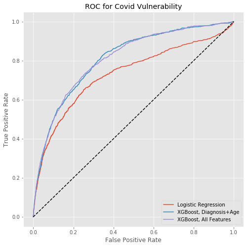

> [Join us for our webinar](https://closedloop.ai/cv19index-webinar) on the CV19 Index on Wednesday, April 8th, 2020 from 2:00 – 3:00pm CDT.

__With the 1.1.0 release, the CV19 Index can now make predictions for any adult.  It is no longer restricted to Medicare populations.__ 

  

# The COVID-19 Vulnerability Index (CV19 Index)

[](https://opensource.org/licenses/BSD-3-Clause)
[](https://pypi.python.org/pypi/cv19index/)

[Install](#installing-the-cv19-index) |
[Data Prep](#data-prep) |
[Running The Model](#running-the-model) |
[Interpreting Results](#interpreting-the-results) |
[Model Performance](#model-performance) |
[Contributing](#contributing-to-the-cv19-index) |
[Release Notes](NEWS.md)

The  COVID-19 Vulnerability Index (CV19 Index) is a predictive model that identifies people who are likely to have a heightened vulnerability to severe complications from COVID-19 (commonly referred to as “The Coronavirus”).  The CV19 Index is intended to help hospitals, federal / state / local public health agencies and other healthcare organizations in their work to identify, plan for, respond to, and reduce the impact of COVID-19 in their communities.

Full information on the CV19 Index, including the links to a full FAQ, User Forums, and information about upcoming Webinars is available at http://cv19index.com

## Data Requirements

This repository provides information for those interested in running the COVID-19 Vulnerability Index on their own data.  We provide the index as a pretrained model implemented in Python.  We provide the source code, models, and example usage of the CV19 Index.

The CV19 Index utilizes only a few fields which can be extracted from administrative claims or electronic medical records.  The data requirements have intentionally been kept very limited in order to facilitate rapid implementation while still providing good predictive power.   ClosedLoop is also offering a free, hosted version of the CV19 Index that uses additional data and provides better accuracy. For more information, see http://cv19index.com

## Install

The CV19 Index can be installed from [PyPI](https://pypi.org/project/shap):

<pre>
pip install cv19index
</pre>

_Notes for windows users_:  Some Microsoft Windows users have gotten errors when running pip related to installing the SHAP and XGBoost dependencies.  For these users we have provided prebuilt wheel files.  To use these, download the wheel for [SHAP](https://c19-survey.s3.amazonaws.com/share/shap-0.33.0-cp37-cp37m-win_amd64.whl) and/or [XGBoost](https://c19-survey.s3.amazonaws.com/share/xgboost-1.0.1-py3-none-win_amd64.whl) to your machine.  Then, from the directory where you downloaded the files, run:

<pre>
pip install xgboost-1.0.1-py3-none-win_amd64.whl
pip install shap-0.33.0-cp37-cp37m-win_amd64.whl
</pre>

These wheel files are for Python 3.7.  If you have a different Python version and would like prebuilt binaries, try https://www.lfd.uci.edu/~gohlke/pythonlibs/ .  If you still have trouble, please create a GitHub issue. 

## Data Prep

The CV19 Index requires 2 data files, a demographics file and a claims file.  They can be comma-separated value (CSV) or Excel files.  The first row is a header file and remaining rows contain the data.  In each file, certain columns are used, and any extra columns will be ignored.

The model requires at least 6 months of claims history, so only those members with at least 6 months of prior history should be included.  It is not necessary that they have any claims during this period.

Sample input files are in the examples directory. [demographics.xlsx](examples/demographics.xlsx) and [claims.xlsx](examples/claims.xlsx) 

#### Demographics File

The demographics file should contain one row for each person on whom you want to run a prediction.

There are 3 required fields in the demographics file:
* __personId__ - An identifier for each person.  It is only used as a link into the claims table and to identify individuals in the output file.  Each row in the demographics file must have a unique personId.
* __age__ - Current age in years, specified as an integer
* __gender__ - This can either be a string column containing the values 'male' or 'female', or it can be an integer column containing the numbers 0 and 1.  For integer columns, 0 is female and 1 is male.  Only binary genders are currently supported.  

#### Claims File

The claims file contains a summary of medical claims for each patient.  There can be multiple rows for each patient, one per claim.  Both inpatient and outpatient claims should be included in the one file.  If a patient has no claims, that patient should have no corresponding rows in this file. 

There are 6 required fields and several optional fields in the claims file:

* __personId__ - An identified that should match with the `personId` from the demographics table.
* __admitDate__ - For inpatient claims, this is the date of admission to the hospital.  For outpatient claims this should be the date of service.  This field should always be filled in.  Dates in CSV files should  be in the form YYYY-MM-DD.
* __dischargeDate__ - For inpatient claims, this is the date of discharge from the hospital.  For outpatient claims this should be left empty.
* __erVisit__ - Flag indicating whether this claim was for an emergency room visit.  Values which are empty, 0, or false will be considered false.  Other values will be considered true.
* __inpatient__ - Flag indicating whether this was an inpatient claim.  If true, then dischargeDate should be set.  Values which are empty, 0, or false will be considered false.  Other values will be considered true.
* __dx1__ - This field contains the primary ICD-10 diagnosis code for the claim.  The code should be a string and can be entered with or without the period.  e.g. `Z79.4` or `Z794`
* __dx2-dx15__ - These are optional fields that can contain additional diagnosis codes for the claim.  The ordering of diagnosis codes is not important.

Note, if a patient first goes to the emergency room and then is later admitted, both the `erVisit` and `inpatient` flags should be set to true.

If you need to enter more than 15 diagnosis codes for a claim, you can repeat the row, set the erVisit and inpatient flags to false, and then add in the additional diagnosis codes on the new row.

## Running the model

If you have installed the CV19 Index from PyPI, it will create an executable that you can run.  The following command run from the root directory of the GitHub checkout will generate predictions on the example data and put results at `examples/predictions.csv`.

_Note: The `-a 2018-12-31` is only needed because the example data is from 2018.  If you are using current data you can omit this argument._ 

```bash
cv19index -a 2018-12-31 examples/demographics.csv examples/claims.csv examples/predictions.csv
```

We also prove a `run_cv19index.py` scripts you can use to generate predictions from Python directly:

```bash
python run_cv19index.py -a 2018-12-31 examples/demographics.csv examples/claims.csv examples/predictions.csv
```

Help is available which provides full details on all of the available options:

```bash
python run_cv19index.py -h
```

## Interpreting the results

The output file created by the CV19 Index contains the predictions along with the explanations of the factors the influenced those predictions.

If you simply want a list of the most vulnerable people, sort the file based on descending prediction.  This will give you the population sorted by vulnerability, with the most vulnerable person first.

If you'd like to do more analysis, the predictions file also contains other information, including explanations of which factors most influenced the risk, both positively and negatively. 

Here is a sample of the predictions output:

| personId  | prediction | risk_score | pos_factors_1 | pos_patient_values_1 | pos_shap_scores_1 | ... |
| ------------- | ------ | ------ | ------ | ------ | ------ | ------ |
| 772775338f7ee353 | 0.017149 | 100 | Diagnosis of Pneumonia | True | 0.358
| d45d10ed2ec861c4 | 0.008979 | 98 |  Diagnosis of Pneumonia | True | 0.264
                                                                      
In addition to the personId, the output contains:
* __prediction__ - This is raw outcome of the model.  It should not be interpreted as the probability that the patient will have complications related to COVID-19 due to several factors, including the fact that a proxy endpoint was used and details around how the model was trained.  A doubling of the prediction value indicates a doubling of the person's risk.
* __risk_score__ - This percentile which indicates where this prediction lies in the distribution of predictinos on the test set.  A value of 95 indicates that the prediction was higher than 95% of the test population, which was designed to be representative of the overall US population.
* __pos_factors_1-10__ - These are the names of the _Contributing Factors_ which most increased the risk for this person.  Factor 1 had the largest effect and 10 had the least.  Not everyone will have 10 positive factors.
* __pos_patient_values_1-10__ - The feature value that this person had for the associated _Contributing Factor_.  For example, if factor 1 is "Diagnosis of Diseases of the circulatory system in the previous 12 months" and the value is "TRUE", that means the most important variable which increased this person's risk is that they were diagnosed with a circulatory disease in the last 12 months.  All of the diagnosis categories are available in the [CCSR](https://www.hcup-us.ahrq.gov/toolssoftware/ccsr/ccs_refined.jsp).
* __pos_shap_scores_1-10__ - Contributing factors are calculated using [SHAP scores](https://github.com/slundberg/shap).  These are the SHAP scores associated with the factors.
* __neg_factors_1-10__ - These are equivalent to the pos_factors, except these are features that decreased the person's risk.
* __neg_patient_values_1-10__ - These are equivalent to the pos_patient_values, except these are features that decreased the person's risk.
* __neg_shap_scores_1-10__ - These are equivalent to the pos_shap_scores, except these are features that decreased the person's risk.


## Model Performance
There are 3 different versions of the CV19 Index.  Each is a different predictive model for the CV19 Index.  The models represent different tradeoffs between ease of implementation and overall accuracy.  A full description of the creation of these models is available in the accompanying MedRxiv paper, ["Building a COVID-19 Vulnerability Index"](https://www.medrxiv.org/content/10.1101/2020.03.16.20036723v2) (http://cv19index.com).

The 3 models are:

* _Simple Linear_ - A simple linear logistic regression model that uses only 14 variables.  An implementation of this model is included in this package.  This model had a 0.731 ROC AUC on our test set.  A pickle file containing the parameters for this model is available in the [lr.p file](cv19index/resources/logistic_regression/lr.p).

* _Open Source ML_ - An XGBoost model, packaged with this repository, that uses Age, Gender, and 500+ features defined from the [CCSR](https://www.hcup-us.ahrq.gov/toolssoftware/ccsr/ccs_refined.jsp)  categorization of diagnosis codes.  This model had a 0.810 ROC AUC on our test set.

* _Free Full_ - An XGBoost model that fully utilizes all the data available in Medicare claims, along with geographically linked public and Social Determinants of Health data.  This model provides the highest accuracy of the 3 CV19 Indexes but requires additional linked data and transformations that preclude a straightforward open-source implementation.  ClosedLoop is making a free, hosted version of this model available to healthcare organizations.  For more information, see http://cv19index.com.

We evaluate the model using a full train/test split.  The models are tested on 369,865 individuals.  We express model performance using the standard ROC curves, as well as the following metrics:
<table style="width:100%">
  <tr>
    <th>Model</th>
    <th>ROC AUC</th>
    <th>Sensitivity as 3% Alert Rate</th>
    <th>Sensitivity as 5% Alert Rate</th>
  </tr>
  <tr>
    <td>Logistic Regression</td>
    <td>.731</td>
    <td>.214</td>
    <td>.314</td>
  </tr>
  <tr>
    <td>XGBoost, Diagnosis History + Age</td>
    <td>.810</td>
    <td>.234</td>
    <td>.324</td>
  </tr>
  <tr>
    <td>XGBoost, Full Features</td>
    <td>.810</td>
    <td>.251</td>
    <td>.336</td>
  </tr>
</table>



## Contributing to the CV19 Index

We are not allowed to share the data used to train the models with our collaborators, but there are tons of ways you can help.  If you are interested in participating, just pick up one of the issues marked with the GitHub "help wanted" tag or contact us at covid19-info@closedloop.ai  

A few examples are:
* Helping us build mappings from common claims data formats for this predictor, such as OMAP and CCLF.  https://www.ohdsi.org/data-standardization/the-common-data-model/
* Converting CMS BlueButton data into a format usable by this model: https://https://bluebutton.cms.gov/  
* Providing install instructions and support on more platforms.


